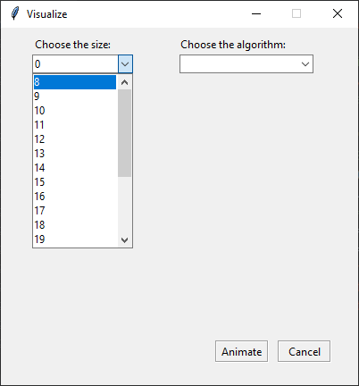
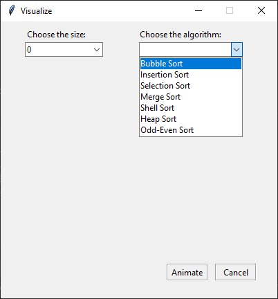
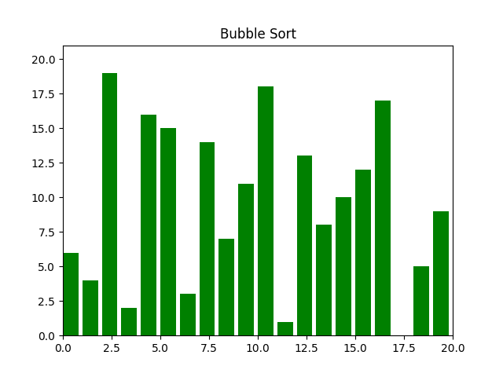
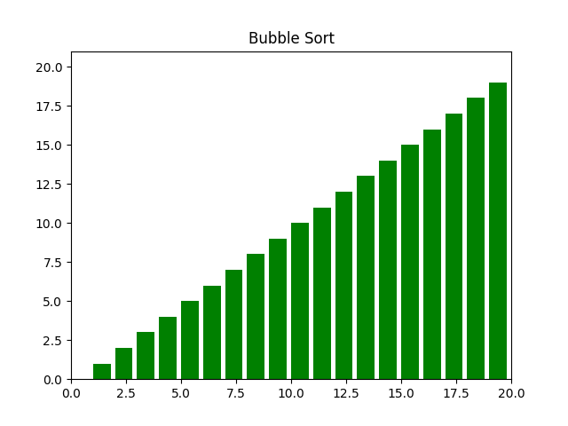

# Description
The program visualizes the most common eight sorting algorithms using `matplotlib`'s `FuncAnimation`class. What are sorting algorithms,they are used to rearrange a given array or list elements according to a comparison operator on the elements. The comparison operator is used to decide the new order of element in the respective data structure. Furthermore for User Interface purposes I used `tkinter` module, and another addition module `random`. Here you can find out more about [sorting algorithms](https://www.geeksforgeeks.org/sorting-algorithms/), and here for more inside to [FuncAnimation](https://matplotlib.org/3.3.3/api/_as_gen/matplotlib.animation.FuncAnimation.html). 


## Setup

Use the package manager [pip](https://pip.pypa.io/en/stable/) to install tkinter, matplotlib and random.

```
pip install tkinter
```
```
pip install matplotlib
```
```
pip install random
```


## Usage

You could use the program to understand how each algotigthm works, or sorts a list!

After setup; __RUN__ the code, you must see the following window,

  

Here you choose the size of array and sorting algorithm. After hit **Animate**.

This is the initial stage of visualization. Program will keep repeating the visualization until it is fully sorted.

 

This is the final stage and the program has completed the sorting!




## Code

The program is fully self-explanatory, one thing may stand out and that is `yield` and `yield from`.`FuncAnimation` class takes four required parameters. It makes an animation by repeatedly calling a function _func_. In order to pass data to __func__ and each __frame__, we need to use __generator functions__. Generator functions allow us to declare a function that behaves like an iterator, i.e. as _for loop_. Here you can learn more about [generators](https://realpython.com/introduction-to-python-generators/).


| Parameter | Description |
| ------ | ----------- |
| fig    | The figure object used to get needed events, such as draw or resize. |
| func   | The function to call at each frame. The first argument will be the next value in frames. |
|frames  | Source of data to pass func and each frame of the animation |
| fargs  | Additional arguments to pass to each call to func. |

Here a function in my program, what is a example of generator function:

```python
def selection_sort(list_):
    for i in range(len(list_)):
        lowest_value_index = i
        yield list_
        for j in range(i + 1, len(list_)):
            if list_[j] < list_[lowest_value_index]:
                lowest_value_index = j
                yield list_
        list_[i], list_[lowest_value_index] = list_[lowest_value_index], list_[i]
        yield list_
        
 ```
